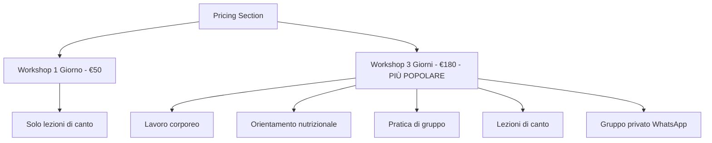
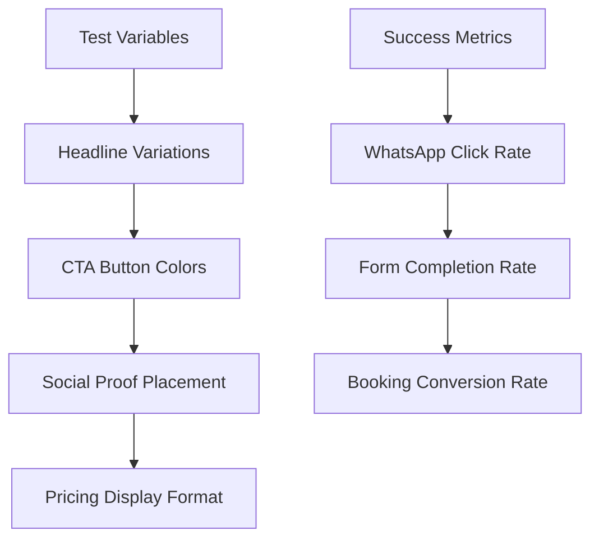

# FreeVoice.es Landing Page Optimization Design

## Overview

This design document outlines critical improvements to the FreeVoice.es landing page to achieve high conversion rates based on established psychological principles and conversion optimization rules. The current implementation violates several fundamental landing page conversion principles that must be addressed to maximize lead generation and booking conversions.

## Architecture Analysis

### Current Implementation Issues

**Critical Violations Identified:**

1. **Focus Violation (1:1 Attention Ratio)**: The header contains extensive navigation menu with multiple distractions (features, coaches, testimonials, pricing, FAQ) that create "leaks" in the conversion funnel
2. **Pricing Misalignment**: Current pricing structure shows 3 plans (Essential €180, Premium €350, VIP €750) but rules specify only 2 plans: "Workshop di 1 Giorno" (€50) and "Workshop di 3 Giorni" (€180)
3. **Footer Navigation Leaks**: Footer contains extensive site navigation and external program links that divert attention from the primary conversion goal
4. **Language Inconsistency**: Site targets Spanish/Italian markets but rules specify Italian/Spanish only
5. **Social Proof Placement**: Current social proof is minimal and not optimally positioned in the conversion flow

### Repository Type: Frontend Application (Next.js)
- Next.js 14 with App Router
- React Server Components
- Tailwind CSS styling
- Multilingual support (ES/IT)
- Component-based architecture

## Landing Page Conversion Optimization

### 1. Implement Singular Focus (Regola 1)

**Architectural Changes Required:**

``mermaid
graph TD
    A[Landing Page] --> B[Hero Section Only]
    B --> C[Value Proposition]
    C --> D[Social Proof]
    D --> E[Pricing - 2 Plans Only]
    E --> F[Single CTA]
    
    G[Current Navigation] -.-> H[REMOVE ALL LINKS]
    I[Footer Links] -.-> H
    J[Social Media] -.-> H
```

**Implementation:**
- **Remove Complete Header Navigation**: Eliminate all anchor links (#features, #coaches, #testimonials, #pricing, #faq)
- **Minimize Footer**: Remove all "Quick Links", "Programs" sections, keep only essential contact information
- **Single CTA Focus**: All page elements must direct to WhatsApp booking only
- **Language Switcher Only**: Maintain only language selection functionality

### 2. Hero Section Optimization (Regola 2)

**"Above the Fold" Requirements:**

``mermaid
graph LR
    A[Headline] --> B[Subheading] 
    B --> C[Visual Element]
    C --> D[Primary CTA]
    D --> E[Social Proof]
    
    F[5-Second Blink Test] --> G[What is offered?]
    G --> H[Why should I care?]
    H --> I[What do I do now?]
```

**Hero Section Architecture:**
- **Benefits-Oriented Headline**: "Scopri la Tua Voce Autentica in 3 Giorni" (IT) / "Descubre Tu Voz Auténtica en 3 Días" (ES)
- **Supporting Subheading**: Emotional outcome focus rather than feature listing
- **High-Quality Visual**: Professional coaching session imagery showing transformation
- **Primary CTA**: Prominent WhatsApp booking button using FreeVoice brand colors (#F02A30 - Rosso Vibrante)

### 3. Corrected Pricing Structure (Per Rules)

**CRITICAL CORRECTION REQUIRED:**

Current pricing violates rules. Must implement exactly:

| Plan | Duration | Price | Features |
|------|----------|-------|----------|
| Workshop di 1 Giorno | 1 Day | €50 | Solo lezioni di canto |
| Workshop di 3 Giorni ⭐ | 3 Days | €180 | Lavoro corporeo + orientamento nutrizionale + pratica di gruppo + lezioni di canto + accesso Gruppo privato WhatsApp |

**Pricing Section Schema:**


### 4. Persuasion Flow Implementation (Regola 3)

**AIDA Model Application:**

``mermaid
graph TD
    A[ATTENZIONE - Hero] --> B[INTERESSE - Value Prop]
    B --> C[DESIDERIO - Social Proof]
    C --> D[AZIONE - CTA]
    
    E[Riprova Sociale] --> F[Testimonianze Cliente]
    F --> G[Recensioni Verificate]
    G --> H[Casi di Studio]
    H --> I[Menzioni Media]
```

**Social Proof Enhancement:**
- **Customer Testimonials**: Real transformation stories with photos
- **Verified Reviews**: 4.9/5 rating with specific student count
- **Media Mentions**: Professional recognition and certifications
- **Success Cases**: Before/after vocal performance improvements

### 5. Lead Capture Form Optimization (Regola 4)

**Friction-Free Form Design:**

``mermaid
graph LR
    A[Form Fields] --> B[Nome Required]
    B --> C[WhatsApp Required]
    C --> D[Preferenza Workshop]
    D --> E[Submit to WhatsApp]
    
    F[Validation] --> G[Inline Checking]
    H[Privacy] --> I[GDPR Notice]
    J[Mobile] --> K[Large Touch Targets]
```

**Form Requirements:**
- **Minimal Fields**: Nome, WhatsApp, Workshop preference (1 giorno/3 giorni)
- **Inline Validation**: Real-time field checking
- **Privacy Assurance**: Clear GDPR compliance statement
- **Mobile-First**: Large, easily tappable buttons (min 44px height)

## Movement & Animation Strategy (Parte II)

### Intentional Animation Implementation

**Strategic Animation Purposes:**

``mermaid
graph TB
    A[Animation Strategy] --> B[Guide Attention]
    B --> C[Provide Feedback]
    C --> D[Enhance Storytelling]
    D --> E[Improve Usability]
    
    F[CTA Button] --> G[Subtle Pulse Effect]
    H[Form Fields] --> I[Focus State Animation]
    J[Scroll Reveal] --> K[Progressive Information]
```

**Implementation Guidelines:**
- **CTA Attention**: Subtle pulsing on primary booking button (#F02A30 color)
- **Microinteractions**: Form field focus states with 300ms ease-in-out
- **Scroll-Triggered**: Fade-in testimonials and pricing cards
- **Performance**: CSS transforms and opacity only, never layout properties
- **Accessibility**: Respect `prefers-reduced-motion` media query

### Choreographed Movement Sequence

**Timing Requirements:**
- Form interactions: 200-300ms
- Scroll reveals: 400-500ms staggered
- CTA pulse: 2s interval, 1s duration
- No simultaneous animations

## Typography Hierarchy (Parte III)

### Visual Information Hierarchy

**Typographic Scale Implementation:**

| Element | Mobile | Desktop | Line Height | Weight |
|---------|--------|---------|-------------|--------|
| H1 (Hero Title) | 32px/2rem | 48px/3rem | 1.2 | Bold |
| H2 (Section Titles) | 28px/1.75rem | 36px/2.25rem | 1.2 | Bold |
| Body Text | 18px/1.125rem | 20px/1.25rem | 1.6 | Regular |
| CTA Button | 18px/1.125rem | 20px/1.25rem | 1.4 | Semibold |

**Typography Rules:**
- **Base Font Size**: 18px minimum for body text
- **Line Length**: 45-75 characters per line
- **Contrast**: Meet WCAG AA standards (4.5:1 for normal text)
- **Responsive Scaling**: Use rem units for consistent scaling

### Brand Color Integration

**FreeVoice Color Palette Application:**

``mermaid
graph LR
    A[Primary Text] --> B[#3C318D - Viola Scuro]
    C[CTA Buttons] --> D[#F02A30 - Rosso Vibrante]
    E[Accents] --> F[#9852A7 - Viola]
    G[Shadows] --> H[#2B2363 - Ombra Viola]
    I[Academy Text] --> J[#FFFFFF - Bianco]
```

## Color Psychology & Accessibility (Parte IV)

### Strategic Color Application

**Conversion-Focused Color Strategy:**
- **Primary CTA**: #F02A30 (Rosso Vibrante) for urgency and action
- **Secondary Elements**: #9852A7 (Viola) for sophistication
- **Text Hierarchy**: #3C318D (Viola Scuro) for trust and authority
- **Background Contrast**: Ensure 4.5:1 minimum ratio for all text

### WCAG Compliance Matrix

| Element Combination | Contrast Ratio | WCAG Level |
|---------------------|----------------|------------|
| Viola Scuro on White | 8.2:1 | AAA |
| Rosso Vibrante on White | 5.1:1 | AA |
| Viola on White | 4.8:1 | AA |
| White on Viola Scuro | 8.2:1 | AAA |

## Technical Implementation (Parte V)

### Performance-First Architecture

**Next.js Optimization Strategy:**

``mermaid
graph TB
    A[Landing Page] --> B[Static Generation]
    B --> C[Minimal JavaScript]
    C --> D[CSS Transforms Only]
    D --> E[Optimized Images]
    E --> F[Critical CSS Inline]
```

**Technical Requirements:**
- **Static Site Generation**: Pre-render landing page for maximum speed
- **Minimal Client JS**: Only essential interactivity (form validation, language switching)
- **Image Optimization**: Next.js Image component with WebP format
- **CSS Strategy**: Critical path CSS inlined, non-critical deferred
- **Performance Budget**: LCP < 2.5s, FID < 100ms, CLS < 0.1

### Component Architecture Refactoring

**Simplified Component Structure:**

``mermaid
graph TD
    A[LandingPage] --> B[MinimalHeader]
    B --> C[HeroSection]
    C --> D[ValueProposition]
    D --> E[SocialProof]
    E --> F[PricingSection]
    F --> G[LeadCaptureForm]
    G --> H[MinimalFooter]
    
    I[Removed Components] -.-> J[FeaturesSection]
    I -.-> K[CoachesSection]
    I -.-> L[TestimonialsSection]
    I -.-> M[FAQSection]
    I -.-> N[CTASection]
```

**Component Removal Strategy:**
- Eliminate FeaturesSection (violates single focus)
- Remove CoachesSection (creates decision paralysis)
- Consolidate TestimonialsSection into Social Proof
- Delete FAQSection (creates doubt, adds friction)
- Remove separate CTASection (CTA integrated throughout)

## Form Processing Architecture

### WhatsApp Integration Optimization

**Booking Flow Enhancement:**

``mermaid
graph LR
    A[Form Submit] --> B[Client Validation]
    B --> C[Format WhatsApp Message]
    C --> D[Open WhatsApp Deep Link]
    D --> E[Pre-filled Message]
    
    F[Message Template] --> G[Workshop Selection]
    G --> H[Contact Information]
    H --> I[Availability Request]
```

**Message Template Structure:**
```
Ciao! Vorrei prenotare:
- Workshop: [1 Giorno €50 / 3 Giorni €180]
- Nome: [User Input]
- WhatsApp: [User Input]
- Preferenza data: [Calendar Selection]

Grazie!
```

## Mobile-First Responsive Design

### Critical Breakpoint Strategy

**Responsive Implementation:**

| Breakpoint | Width | Layout Changes |
|------------|-------|----------------|
| Mobile | < 768px | Single column, stacked pricing |
| Tablet | 768px - 1024px | Two-column pricing |
| Desktop | > 1024px | Optimized spacing, larger CTAs |

**Mobile Optimization:**
- Touch targets minimum 44px
- Simplified navigation (language switcher only)
- Thumb-friendly CTA placement
- Reduced cognitive load per screen

## Testing Strategy

### A/B Testing Framework

**Conversion Test Variables:**



**Key Performance Indicators:**
- WhatsApp link click-through rate
- Form completion percentage  
- Actual booking conversion rate
- Time spent above the fold
- Bounce rate reduction

### User Experience Validation

**Usability Testing Checklist:**
- 5-second clarity test for value proposition
- Mobile form completion without friction
- CTA button visibility across devices
- Language switching functionality
- WCAG accessibility compliance

## Implementation Roadmap

### Phase 1: Critical Conversion Fixes (Week 1)
1. Remove all navigation menu items except language switcher
2. Correct pricing structure to 2-plan model (€50/€180)
3. Implement single-focus hero section
4. Optimize primary CTA with brand colors

### Phase 2: Content & Social Proof (Week 2)
1. Integrate customer testimonials strategically
2. Add verified review ratings
3. Implement lead capture form optimization
4. Create compelling value proposition copy

### Phase 3: Performance & Polish (Week 3)
1. Implement CSS-only animations
2. Optimize images and loading performance
3. Add A/B testing framework
4. Complete accessibility audit

### Phase 4: Testing & Iteration (Week 4)
1. Deploy conversion tracking
2. Run A/B tests on key elements
3. Analyze user behavior data
4. Iterate based on performance metrics

This design ensures compliance with all specified conversion rules while maintaining the technical excellence of the Next.js implementation. The focus shifts from information architecture to conversion optimization, creating a precision marketing asset designed for maximum lead generation and booking conversions.
